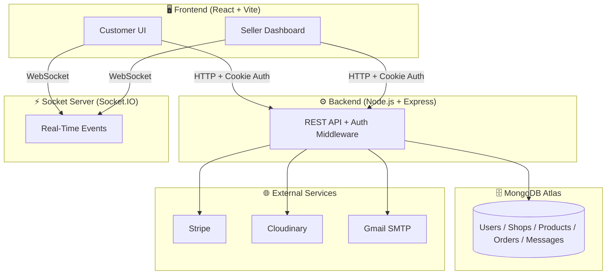
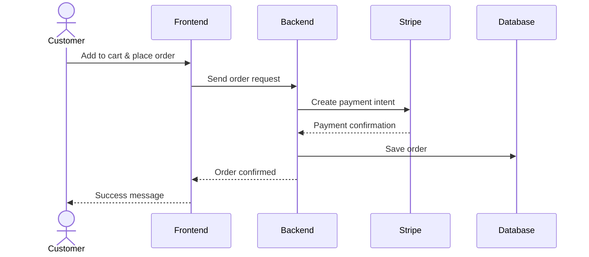
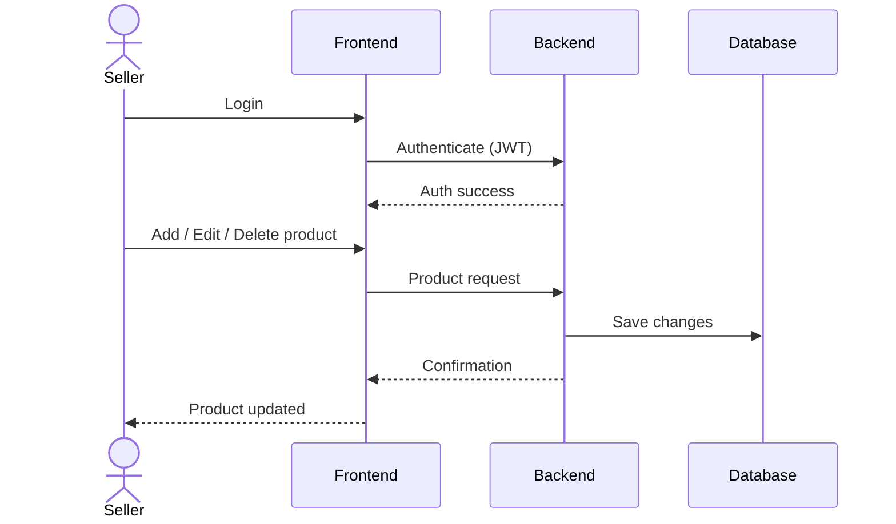
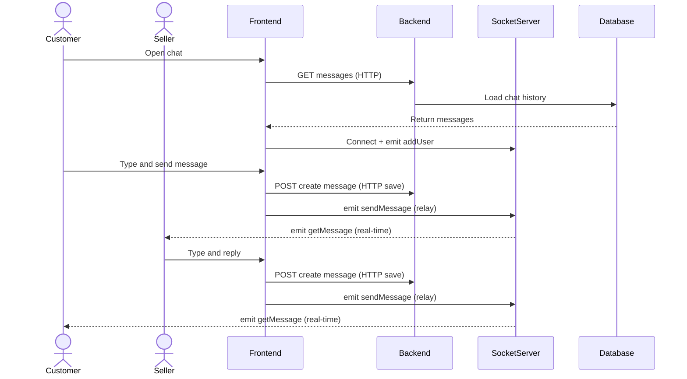
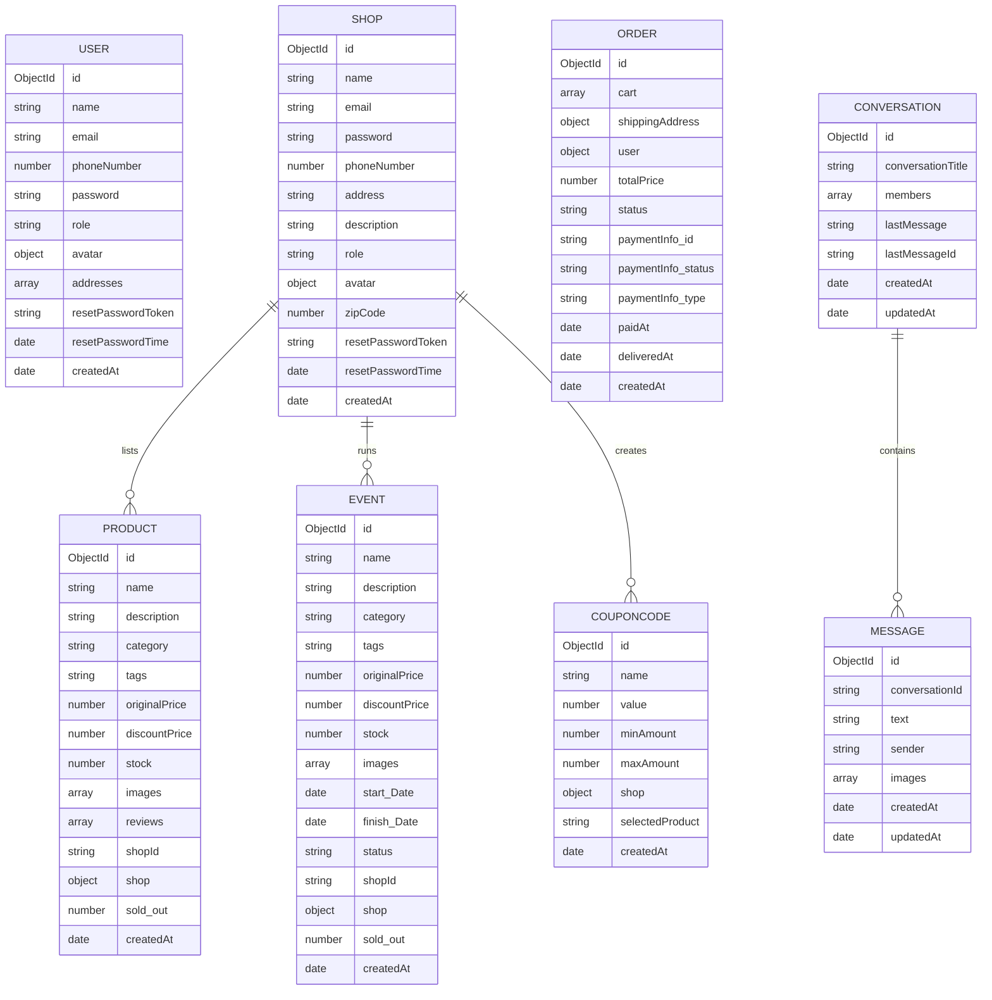

<div align="center">

# 🛒 MultiMart — Multivendor E-Commerce Platform

### Full-Stack MERN marketplace with real-time chat, Stripe payments, and multi-role dashboards

[](https://multi-mart-fastwithkamran.vercel.app)
[](LICENSE)
[](https://react.dev)
[](https://nodejs.org)
[](https://mongodb.com)

</div>

---

## Introduction

MultiMart is a production-ready multivendor e-commerce platform where multiple sellers run their own storefronts, and customers can browse, purchase, and pay — all in one place.

Built to simulate real-world platforms like **Amazon** and **Daraz**, this project covers the full development lifecycle: REST API design, JWT authentication, real-time messaging, Stripe and Paypal payments, cloud image storage, and serverless deployment.

> Built as a portfolio project to strengthen full-stack skills.

---

## Problem Statement

Most beginner e-commerce projects are single-vendor — only the platform owner manages products. This limits scalability and product diversity.

MultiMart solves this by:

- Giving **sellers** their own dashboards to manage shops and products
- Giving **customers** a smooth experience with cart, wishlist, and secure checkout
- Enabling **real-time communication** between buyers and sellers

---

## Tech Stack

### Frontend

| | Technology |
| --- | --- |
| Framework | React 19 + Vite |
| State Management | Redux Toolkit |
| Routing | React Router v7 |
| Styling | Tailwind CSS v4 |
| UI Components | Material UI (MUI) |
| Payments | Stripe.js & PayPal |
| Real-Time | Socket.IO Client |
| HTTP Client | Axios |

### Backend

| | Technology |
| --- | --- |
| Server | Node.js + Express 5 |
| Database | MongoDB + Mongoose |
| Auth | JWT + HTTP-only cookies |
| Passwords | Bcrypt |
| Images | Cloudinary + Multer |
| Email | Nodemailer (Gmail SMTP) |
| Payments | Stripe API |

### Infrastructure

| | Technology |
| --- | --- |
| Deployment | Vercel (frontend + backend), Render (socket) |
| Database Hosting | MongoDB Atlas |
| Monitoring | Uptime Robot |

---

## System Architecture



---

## Features

### 👤 Customer

- Register & log in with email activation
- Browse products by category, search, and best-selling
- Add to cart and wishlist
- Checkout with **Stripe** payment
- Apply coupon codes
- Track orders and request refunds
- Real-time chat with sellers

### 🏪 Seller

- Create and manage a branded storefront
- Add, update, and delete products & events
- Manage orders and process refunds
- Generate coupon codes
- Real-time inbox to chat with customers
- Withdraw earnings

---

## Workflows

### 🛍️ Customer Checkout



### 🏪 Seller Product Management



### 💬 Real-Time Chat (Customer ↔ Seller)



---

## Database Schema



---

## Project Structure

```
Multi Vendor/
├── backend/
│   ├── config/.env          # Environment variables (gitignored)
│   ├── controllers/         # user, shop, product, order, payment...
│   ├── models/              # Mongoose schemas
│   ├── routers/             # API routes
│   ├── middlewares/         # Auth guards, error handler
│   ├── utils/               # JWT, email, error helpers
│   └── server.js
│
├── frontend/
│   └── src/
│       ├── components/      # Reusable UI components
│       ├── pages/           # Route-level pages
│       ├── redux/           # Store, actions, reducers
│       └── routes/          # Protected routes
│
└── socket/
    └── index.js             # Socket.IO server
```

---

## Getting Started

### Prerequisites

- Node.js v18+, MongoDB Atlas account, Stripe account, Cloudinary account, Gmail App Password

### 1. Clone

```bash
git clone https://github.com/fastwithkamran/Multi_Vendor.git
cd Multi_Vendor
```

### 2. Set up environment variables

**`backend/config/.env`**

```env
PORT=8000
NODE_ENV=development
MONGODB_URI=your_mongodb_uri

JWT_SECRET_KEY=your_jwt_secret
Activation_Secret=your_activation_secret

STRIPE_SECRET_KEY=sk_test_...
STRIPE_API_KEY=pk_test_...

SMTP_HOST=smtp.gmail.com
SMTP_PORT=465
SMTP_SERVICE=gmail
SMTP_MAIL=your@email.com
SMTP_PASSWORD=your_app_password

CLOUDINARY_CLOUD_NAME=your_name
CLOUDINARY_API_KEY=your_key
CLOUDINARY_API_SECRET=your_secret

FRONTEND_API=http://localhost:5173
```

**`frontend/.env`**

```env
VITE_BackEnd_API=http://localhost:8000/api/v1
VITE_SOCKET_API=http://localhost:3000
```

**`socket/.env`**

```env
PORT=3000
FRONTEND_API=http://localhost:5173
```

### 3. Install & run

```bash
# Backend
cd backend && npm install && npm run dev

# Frontend (new terminal)
cd frontend && npm install && npm run dev

# Socket server (new terminal)
cd socket && npm install && npm run dev
```

Open **<http://localhost:5173>** 🎉

---

## API Routes

| Module | Base Route |
| --- | --- |
| Users | `/api/v1/user` |
| Shops | `/api/v1/shop` |
| Products | `/api/v1/product` |
| Events | `/api/v1/event` |
| Coupon Codes | `/api/v1/couponCode` |
| Orders | `/api/v1/order` |
| Payments | `/api/v1/payment` |
| Conversations | `/api/v1/conversation` |
| Messages | `/api/v1/message` |

---

## Screenshots

| Customer Home | Seller Dashboard |
|---|---|
|  |  |

| Product Page | Real-Time Chat |
|---|---|
|  |  |

---

## Challenges & Solutions

| Challenge | Solution |
| --- | --- |
| **Role-based auth across User, Seller & Admin** | JWT with `role` field + dedicated middleware (`isAuthenticated`, `isSeller`, `isAdmin`) per protected route |
| **Serverless incompatibility with Socket.IO** | Deployed Socket.IO as a separate persistent service on **Render** with UptimeRobot keep-alive pings — Vercel serverless cannot hold WebSocket connections |
| **Cross-origin cookies blocked by Chrome third-party policy** | Implemented Vercel `vercel.json` reverse proxy rewrites (`/api/v1/:path*` → backend) — browser sees all traffic as first-party, enabling `SameSite: lax` |
| **Gmail security scanner prefetching one-time JWT activation links** | Button-based activation page (robots cannot click) combined with atomic `findByIdAndDelete` on backend to prevent race conditions |
| **Oversized JWT tokens crashing email links** | Replaced full user object in JWT with MongoDB `_id` only — unverified user data stored in a dedicated TTL collection auto-deleted by MongoDB after 20 minutes |

---

## Key Learnings

- End-to-end MERN development with real production patterns
- JWT auth with HTTP-only cookies and role-based route guards
- Real-time architecture with Socket.IO on a persistent Render service
- Stripe Payment Intents API for secure checkout
- Cloud image storage and delivery with Cloudinary
- Serverless deployment on Vercel + persistent deployment on Render

---

## License

MIT License — see [LICENSE](https://github.com/fastwithkamran/MultiMart/blob/main/LICENSE) for details.

---

## Author

**Kamran Ayaz**

[](https://github.com/fastwithkamran)
[](https://multi-mart-fastwithkamran.vercel.app)

---

<div align="center">⭐ Star this repo if you found it helpful!</div>
